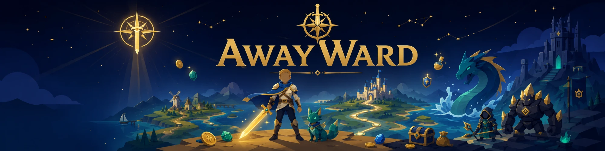
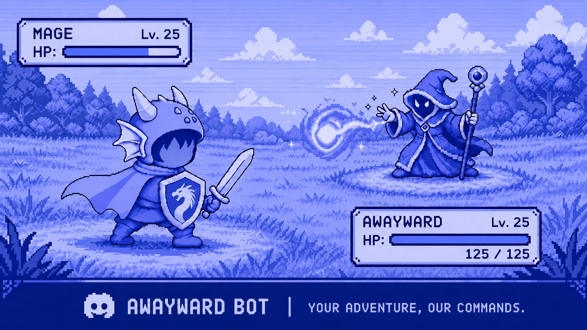
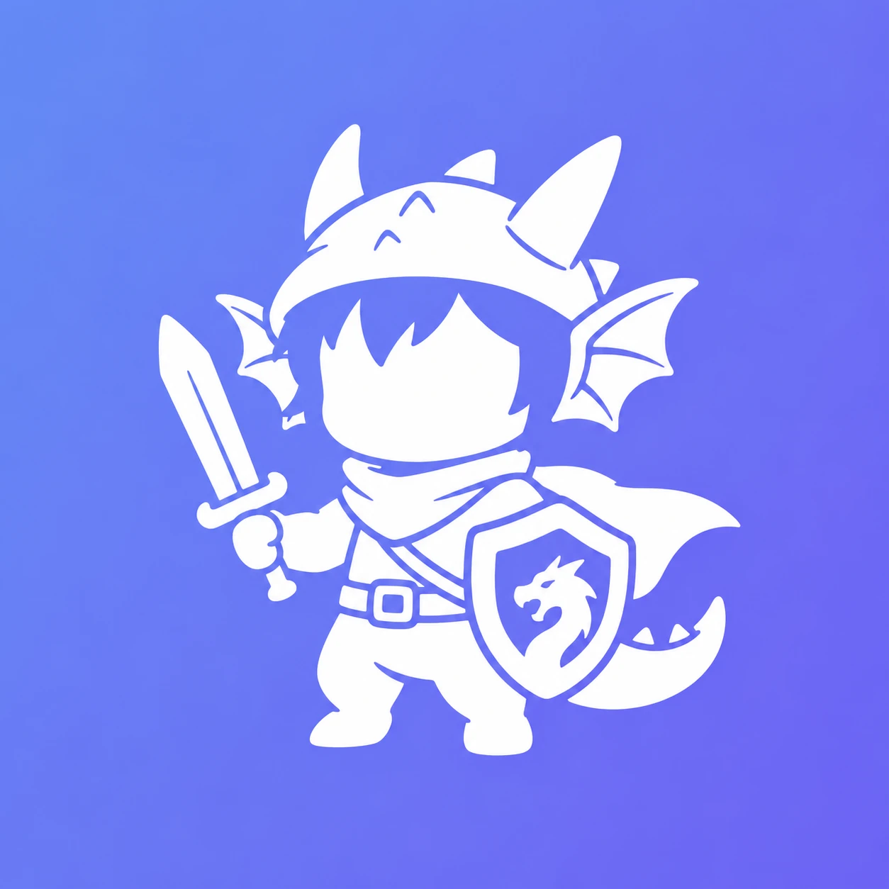

  

<h1 align="center">AwayWard (Godot Edition)</h1>

<b>A complete idle RPG that fights for you, even while the game is closed.</b>

  
  &nbsp;
  
  &nbsp;
  
  &nbsp;
  

  

  
  
  

---

## Download and play

No installer, no account required. Grab your platform above, or pick a version from the [Releases page](https://github.com/dryram3n/awayward-releases/releases/latest).

### Windows

1. **Download** [`AwayWard-windows-latest.zip`](https://github.com/dryram3n/awayward-releases/releases/latest/download/AwayWard-windows-latest.zip).
2. **Unzip every file into one folder** and keep them together (the game ships alongside a few required DLLs, so do not move the .exe out on its own).
3. **Run `AwayWard.exe`** and start your adventure.

> **SmartScreen warning?** Windows may say the app is unrecognized (it is unsigned, not malware). Click **More info**, then **Run anyway**.
>
> **Black or empty window?** Update your graphics drivers first. If that does not help, double-click **"Run in Compatibility (ANGLE) mode.bat"** in the same folder to force a Direct3D 11 backend that runs on almost any GPU.

### macOS

1. **Download** [`AwayWard-macos-latest.zip`](https://github.com/dryram3n/awayward-releases/releases/latest/download/AwayWard-macos-latest.zip) and unzip it. The app is universal, so it runs natively on both Apple Silicon and Intel Macs.
2. The app is not Apple-notarized, so the first launch needs a one-time Gatekeeper approval: **right-click `AwayWard.app` and choose Open**, then confirm. If macOS still blocks it, go to **System Settings, Privacy & Security** and click **Open Anyway**. The bundled **HOW TO OPEN** note walks you through it.

### Linux

1. **Download** [`AwayWard-linux-latest.tar.gz`](https://github.com/dryram3n/awayward-releases/releases/latest/download/AwayWard-linux-latest.tar.gz).
2. Extract it (`tar -xzf AwayWard-linux-latest.tar.gz`) and run the self-contained **`AwayWard.x86_64`**. The tarball preserves the executable bit, so no chmod needed.

### Android

1. **Download** [`AwayWard-android-latest.apk`](https://github.com/dryram3n/awayward-releases/releases/latest/download/AwayWard-android-latest.apk) on your device (arm64, Android 7.0+).
2. Open the APK and allow your browser or file manager to **install unknown apps** when prompted. The APK is signed and asks for the Internet permission only.

The mobile build is the full game behind a touch-first UI: drawer navigation, long-press tooltips, back-button navigation, and layouts tailored to both portrait and landscape.

AwayWard tells you in-game when a new version is out. Saves live in the Godot user folder: `%APPDATA%\Godot\app_userdata\AwayWard\saves` on Windows, `~/Library/Application Support/Godot/app_userdata/AwayWard/saves` on macOS, and `~/.local/share/godot/app_userdata/AwayWard/saves` on Linux.

---

## What is AwayWard?

AwayWard is a genuine idle MMORPG that also plays fully offline. Your hero fights monsters automatically (even while the game is closed), earning gold, XP, gear and pets. Gear up, climb an eleven-zone world map, summon companions, socket runewords, raise factions, and **rebirth** for permanent power.

A live backend powers real player-to-player systems: a cross-player market, co-op parties, shared factions and clans, a server-wide world raid, async ghost-PvP in the Coliseum, a monthly community season, a house-showcase gallery, and a real leaderboard. Lose your connection (or flip on Offline Mode) and a persistent cast of simulated rivals keeps every screen playable. The online layer is co-op and trust-based, so the draw is the shared economy and community, not competitive ladders.

It began life as a Discord bot and grew into a full 2D game built with Godot 4.7.

  <b>10 classes</b> &nbsp;·&nbsp; <b>129 enemies</b> &nbsp;·&nbsp; <b>11 zones</b> &nbsp;·&nbsp; <b>51 pets</b> &nbsp;·&nbsp; <b>60 abilities</b> &nbsp;·&nbsp; <b>38 screens</b>

---

## Highlights

- **Idle auto-combat** built on the original game's exact formulas: 129 enemies, five elite spawn variants, enemy hoards, and offline progress that banks while you are away.
- **Deep loot and builds:** 6 rarities across 8 gear slots, procedural affixes, themed boss sets, and a Runeforge with 13 runewords, sockets, tempering and transmog.
- **Collect everything:** gacha summons with real pity, 51 companion pets, and 60 abilities across 7 schools (including a signature ultimate for each of the 10 classes), plus achievements, titles and challenges.
- **Gather and craft:** mining, woodcutting and fishing across 25 nodes, feeding 9 crafting recipes and an auto-crafter.
- **Endless progression:** prestige into Soul Gems and Ascension upgrades, then spend stardust on a 21-node Constellations talent web.
- **A living world:** seasonal wall-clock events, a Nemesis that hunts you as a dark clone, a tavern full of minigames, and a 6x4 house you decorate and show off.
- **Polished to play:** one-click Equip Best, bulk actions, search and sort, full keyboard and controller navigation, an interactive tutorial, and a starter kit so new heroes survive.

---

## The online realm

Every online screen has a Realm/Online toggle and falls back to a local simulation when you are offline:

- **Leaderboard** ranked by power, level and rebirth
- **Player market** with cross-player consignment listings and atomic sales
- **Co-op parties** you join by code, shared right on the Hunt screen
- **Factions and clans** with pooled points, upgrades, research, buildable clan halls and zone conquest
- **The Convergence**, a server-wide co-op world raid with a shared HP pool and tiered spoils
- **The Coliseum**, async ghost-PvP against snapshots of other players, with a monthly rating ladder
- **House gallery** to publish your home and browse and like others
- A monthly **community season** that every player contributes toward

---

## Hands-on combat, when you want it

AwayWard is idle first, but two optional modes let you take the wheel:

- **Boss Duels:** when a zone boss appears, fight it by hand. Tap abilities on cue and dodge telegraphed windups for bonus loot. Lose and you simply keep your normal idle reward, so a duel is pure upside.
- **Trial Rifts:** an endless gauntlet of scaling waves with a monthly affix twist, plus a season depth leaderboard to climb.

Neither sells power. It is all skill and build flex.

---

## From a Discord bot to a full game

  

AwayWard started as a Discord bot and is now a complete standalone game. The community is still the best place to get updates, report bugs, trade builds and show off your house.

  

---

  

  Built with Godot 4.7 &nbsp;·&nbsp; Desktop builds are unsigned &nbsp;·&nbsp; This repository hosts downloadable releases. See <a href="https://github.com/dryram3n/awayward-releases/releases">Releases</a> for version history and patch notes.

